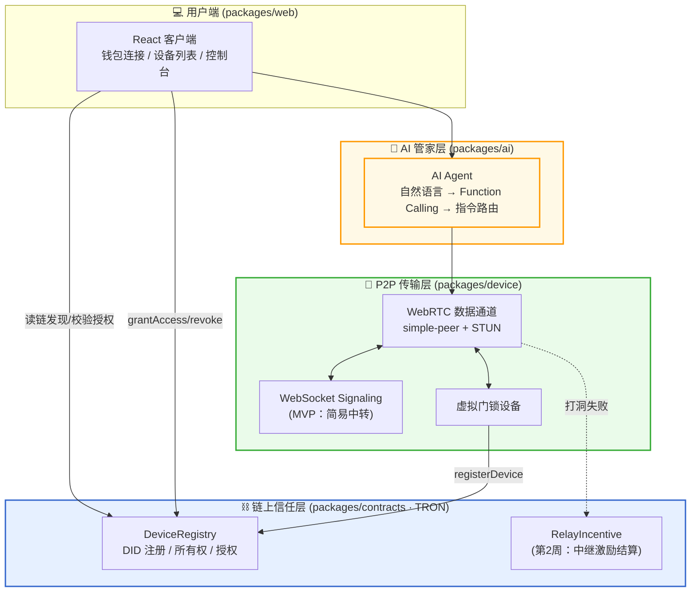
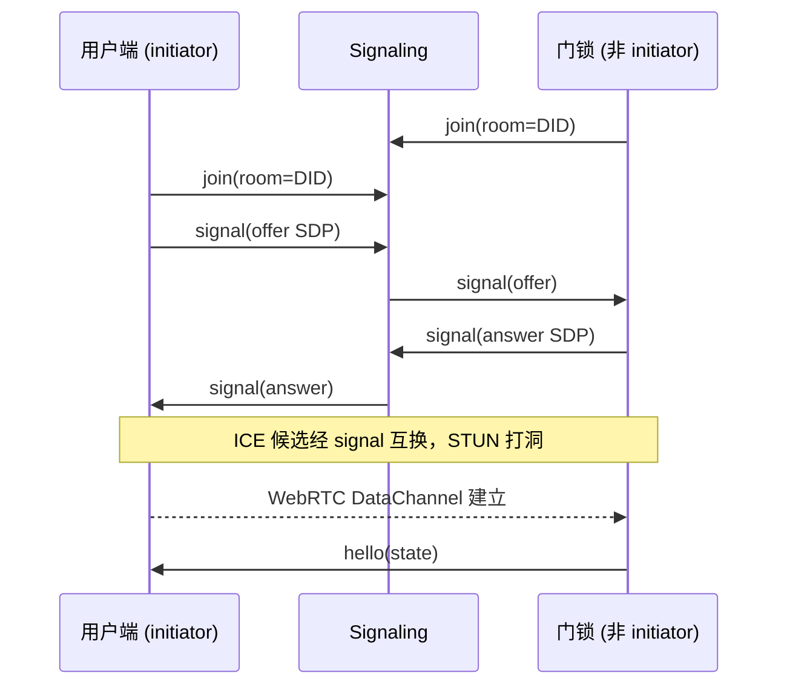
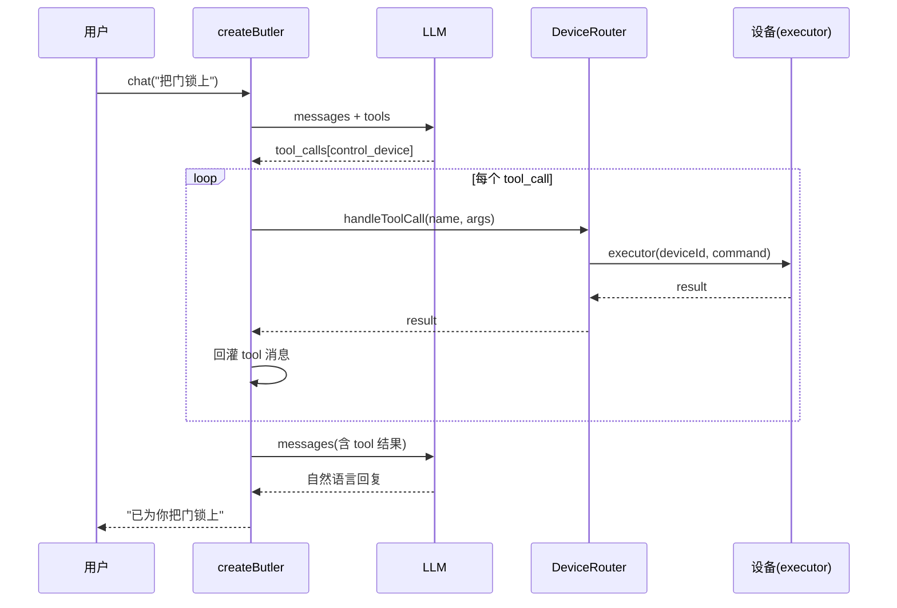
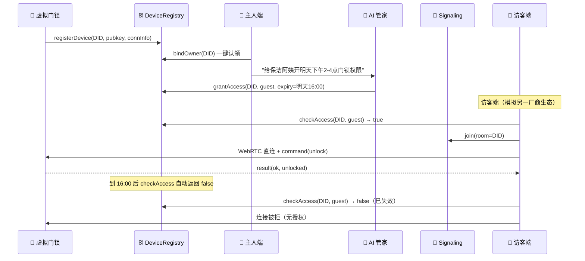

# OmniLink 技术设计文档

> 本文档为 OmniLink（去中心化 IoT 互联与 AI 管家）的详细技术设计，包含高层设计（High-Level Design）与低层设计（Low-Level Design）。
>
> 配套文档：`OmniLink_立项方案.md`（立项）、`OmniLink_一周冲刺计划.md`（执行）。
>
> **生成方式**：分段生成。本文件将按段落陆续补充，当前已完成「第 1 段：概述」。

---

## Overview

（概述）

OmniLink 把智能设备的**身份、所有权、授权**搬到区块链上，让任何支持协议的客户端凭链上授权**直接 P2P 连接**设备，不经厂商中心化云平台；并在这条统一通道之上构建跨品牌的 **AI 管家**。

### 1.1 设计目标

- **去中心化信任**：设备身份（DID）、所有权、授权全部上链（TRON），可公开校验、不可被单一厂商篡改。
- **数据直连**：设备与用户之间走 WebRTC P2P，数据不经业务服务器。
- **跨品牌统一控制**：AI 通过 Function Calling 把自然语言解析为标准化设备指令，跨品牌统一调度。
- **可演示稳定性**：优先保证门锁演示主线端到端跑通且稳定，而非功能堆砌。

### 1.2 非目标（明确不做）

- ❌ 真实 IoT 硬件固件对接（用软件虚拟设备模拟）。
- ❌ 自研 TURN / 数据转发（直接用 coturn，列入第 2 周）。
- ❌ 中继防作弊的密码学验证（zk / TEE，列入 Roadmap）。
- ❌ 复杂多轮对话 / 长期记忆系统。

---

## Architecture

（高层架构）

OmniLink 的核心思想是把"**该去中心化的**"和"**该高效传输的**"分开：信任（身份/授权/发现）上链，数据传输走 P2P 直连。

### 2.1 三层架构图



### 2.2 各层职责与代码映射

| 层 | 代码包 | 职责 | 是否去中心化 | MVP 状态 |
|----|--------|------|:---:|:---:|
| ⛓️ 链上信任层 | `packages/contracts` | 设备 DID、所有权、带时间限制授权；（第2周）中继激励 | ✅ | DeviceRegistry 已编译 |
| 📡 P2P 传输层 | `packages/device` | signaling 中转、WebRTC 直连、虚拟门锁 | ✅（数据不过业务服务器） | P2P 冒烟已通过 |
| 🧠 AI 管家层 | `packages/ai` | 自然语言 → Function Calling → 指令路由 | — | 骨架 + mock 设备可跑 |
| 💻 用户端 | `packages/web` | 钱包连接、设备发现、控制台、AI 入口 | — | Vite+React 骨架 |

### 2.3 关键设计取舍

- **signaling 先走简易 WebSocket**：第 1 周保证 P2P 能通；"signaling 上链"是第 2 周的去中心化升级。
- **TURN 中继 + 激励合约延后**：第 2 周引入 coturn + RelayIncentive 合约；MVP 演示可同局域网直连兜底。
- **AI 只做第 1 层**：自然语言单/多设备控制；场景编排与主动 Agent 属第 2/3 周。

---

## 3. 技术栈与边界 (Tech Stack)

### 3.1 选型

| 维度 | 选型 | 说明 |
|------|------|------|
| 运行时 | Node.js 24 (ESM) | 仓库统一 `"type": "module"` |
| 包管理 | npm workspaces | 单仓多包，共享 P2P/合约 ABI |
| 链 | TRON Nile 测试网 | 测试币免费领，演示成本 ≈ 0 |
| 合约语言 | Solidity ^0.8.20 | `solc` 编译，输出 ABI + bytecode |
| 链交互 | TronWeb（脚本端）/ TronLink（前端） | 部署、读写合约、钱包签名 |
| P2P | WebRTC + `simple-peer` | 点对点数据通道 |
| WebRTC 运行时 | `@roamhq/wrtc` | Node 端 WebRTC 原生实现（`wrtc` 维护分支） |
| Signaling | `ws`（WebSocket） | MVP 简易 SDP/ICE 中转 |
| STUN | 公共 STUN（Google） | ~80% 打洞，免费 |
| TURN（第2周） | coturn（docker） | 去中心化中继节点 |
| AI | OpenAI 兼容 LLM + Function Calling | 自然语言 → 设备指令 |
| 前端 | React 18 + Vite 5 | 用户端 |

### 3.2 依赖边界

- **拿现成的**：STUN、coturn、simple-peer、TronWeb/TronLink、LLM SDK。
- **必须自己写**：DeviceRegistry / RelayIncentive 合约、AI 控制层、虚拟设备、客户端联调。

---

## Data Models

（数据模型）

### 4.1 链上模型（DeviceRegistry）

**Device（设备身份）**

| 字段 | 类型 | 说明 |
|------|------|------|
| `deviceId` | string | 设备 DID（链下生成的唯一标识，如 `omnilink-lock-001`） |
| `pubkey` | bytes | 设备公钥（P2P 握手校验用） |
| `owner` | address | 所有者地址；`address(0)` 表示尚未认领 |
| `connInfo` | string | 连接信息（如 signaling 房间号 / 多地址） |
| `registered` | bool | 是否已注册 |

- 存储键：`deviceKey = keccak256(deviceId)`。
- 设备列表：`deviceKeys[]` 支持枚举（`deviceCount` / `deviceKeyAt`）。

**Access（授权）**

| 结构 | 类型 | 语义 |
|------|------|------|
| `accessExpiry[deviceKey][user]` | uint256 | 授权到期时间戳（Unix 秒） |

- `0` = 无授权；`type(uint256).max` = 永久（所有者默认）；其他值 = 到该时间戳前有效。
- `checkAccess` 读取时用 `block.timestamp` 判断是否过期，实现**时间限制自动失效**。

### 4.2 P2P 消息模型

**信令消息（客户端 ↔ signaling 服务器）**

| 消息 | 字段 | 方向 | 说明 |
|------|------|------|------|
| `join` | `{ type:"join", room }` | client → server | 加入房间（room 通常为设备 DID） |
| `signal` | `{ type:"signal", room?, data }` | 双向 | 转发 WebRTC SDP / ICE 候选 |

**数据通道消息（设备 ↔ 用户端，经 WebRTC DataChannel）**

| 消息 | 字段 | 方向 | 说明 |
|------|------|------|------|
| `hello` | `{ type:"hello", state }` | device → user | 连接建立后上报初始状态 |
| `command` | `{ type:"command", requestId, command:{action,value?} }` | user → device | 下发控制指令 |
| `result` | `{ type:"result", requestId, ok, state?, error? }` | device → user | 指令执行结果回传 |

### 4.3 AI 指令模型（Function Calling）

| 工具 | 参数 | 说明 |
|------|------|------|
| `control_device` | `deviceId`(string), `action`(enum: lock/unlock/status/set_brightness/set_temperature), `value`(number?) | 对单设备下发控制指令 |
| `list_devices` | 无 | 列出当前用户有权访问的设备（来自链上授权校验） |

- `DeviceRouter.handleToolCall(name, args)` 把工具调用路由到具体设备执行器（executor）。
- MVP 执行器为 mock；联调时替换为基于 `peer-channel` 的真实 P2P 下发，并在 `control_device` 前接入链上 `checkAccess` 校验。

> 后续段落（链上信任层详细设计、P2P 传输层、AI 管家层、端到端时序与测试）将陆续补充。

---

## Components and Interfaces

（组件与接口 · 低层设计）

本章为低层设计，分别给出三层的组件划分、接口契约与关键逻辑。

### 5. 链上信任层 (DeviceRegistry)

合约文件：`packages/contracts/contracts/DeviceRegistry.sol`（已编译通过）。

### 5.1 函数签名

| 函数 | 可见性 | 权限 | 说明 |
|------|--------|------|------|
| `registerDevice(string deviceId, bytes pubkey, string connInfo)` | external | 任何人 | 设备自注册 DID；owner 初始为空 |
| `bindOwner(string deviceId)` | external | 任何人（仅未认领时） | 一键认领所有权，owner 默认获永久访问权 |
| `grantAccess(string deviceId, address user, uint256 expiry)` | external | onlyOwner | 授权；`expiry=0` 表示永久 |
| `revokeAccess(string deviceId, address user)` | external | onlyOwner | 撤销授权 |
| `updateConnInfo(string deviceId, string connInfo)` | external | onlyOwner | 更新连接信息 |
| `checkAccess(string deviceId, address user)` | external view | 任何人 | 校验访问权（含时间自动失效） |
| `getDevice(string deviceId)` | external view | 任何人 | 读取设备信息 |
| `deviceCount()` / `deviceKeyAt(uint256)` | external view | 任何人 | 设备枚举 |

### 5.2 事件

```solidity
event DeviceRegistered(bytes32 indexed deviceKey, string deviceId, address indexed registrant);
event OwnerBound(bytes32 indexed deviceKey, address indexed owner);
event AccessGranted(bytes32 indexed deviceKey, address indexed user, uint256 expiry);
event AccessRevoked(bytes32 indexed deviceKey, address indexed user);
event ConnInfoUpdated(bytes32 indexed deviceKey, string connInfo);
```

> 客户端通过监听 `DeviceRegistered` / `AccessGranted` 实现"发现设备"与"授权变更"的实时刷新。

### 5.3 关键逻辑：带时间限制的授权校验

```solidity
function checkAccess(string deviceId, address user) external view returns (bool) {
    uint256 exp = accessExpiry[_key(deviceId)][user];
    if (exp == 0) return false;                 // 无授权
    if (exp == type(uint256).max) return true;  // 永久（所有者）
    return block.timestamp < exp;               // 到期自动失效
}
```

设计要点：
- **撤销 = 置 0**：`revokeAccess` 直接把 `accessExpiry` 置 0，下次 `checkAccess` 即拒绝。
- **过期无需链上清理**：到期判断在 `view` 读取时完成，零额外 gas，无需定时任务。
- **认领即授权**：`bindOwner` 同时给 owner 写入 `type(uint256).max`，避免 owner 还要再给自己授权。

### 5.4 安全校验与边界

| 校验点 | 实现 | 说明 |
|--------|------|------|
| 重复注册 | `require(!registered)` | 同一 deviceId 不可重复注册 |
| 重复认领 | `require(owner == address(0))` | 设备只能被认领一次 |
| 授权权限 | `onlyOwner` 修饰符 | 仅所有者可授权/撤销/改连接信息 |
| 非法地址 | `require(user != address(0))` | 授权对象不可为零地址 |

**已知边界（MVP）**：
- 所有权不可转移（`transferOwner` 列入 Roadmap）。
- 设备 `pubkey` 与实际 P2P 握手的绑定校验在 MVP 为弱校验（链上存公钥，握手层暂不强校验签名），第 2/3 周加固。

### 5.5 部署与产物

- 编译：`npm run compile -w @omnilink/contracts` → `build/DeviceRegistry.json`（ABI + bytecode）。
- 部署：`npm run contracts:deploy` → 写入 `deployments/nile.json`，地址回填 `.env` 的 `DEVICE_REGISTRY_ADDRESS`。
- 前端通过 `build/DeviceRegistry.json` 的 ABI + TronLink 注入的 tronWeb 实例化合约。

### 5.6 扩展点（第2周 RelayIncentive）

| 函数（规划） | 说明 |
|------|------|
| `registerRelay(string endpoint)` | 中继节点注册 + 押金/抵押 |
| `depositEscrow(address relay)` | 用户预存押金 |
| `settle(bytes receipt, bytes sig)` | `ecrecover` 验签后结算代币 |

> 合约只做"验证签名 + 转账"，采用乐观信任模型；合谋刷量边界主动声明并列入 Roadmap（信誉系统、随机抽查、zk）。

---

### 6. P2P 传输层 (packages/device)

### 6.1 模块划分

| 文件 | 职责 |
|------|------|
| `src/signaling-server.js` | WebSocket signaling：房间内转发 SDP/ICE，不存储、不碰数据 |
| `src/peer-channel.js` | `createPeerChannel()`：simple-peer + @roamhq/wrtc 的通道封装，设备/客户端共用 |
| `src/lock.js` | 虚拟门锁：自注册 DID + 等待连接 + 执行 lock/unlock |

### 6.2 signaling 协议

```
client --(join: room)--> server      # 加入房间
client --(signal: data)--> server     # 携带 SDP/ICE
server --(signal: data)--> 房间内其他 peer   # 仅转发，不解析
```

- 房间号 = 设备 DID，保证用户端与目标设备进入同一房间。
- 服务器仅维护 `room -> Set<ws>`，peer 断开即移除，房间空则销毁。
- **边界**：MVP signaling 无鉴权，任何人知道房间号即可加入；访问控制由链上 `checkAccess` + 数据通道层把关（第 2 周 signaling 上链时加鉴权）。

### 6.3 peer-channel 接口契约

```js
createPeerChannel({
  signalingUrl,   // ws://host:port
  room,           // 房间号（设备 DID）
  initiator,      // 发起方 true（一般为用户端），被连方 false（设备）
  iceServers,     // 可选 STUN/TURN 列表，默认公共 STUN
  onData,         // (payload) => void  收到对端数据（已 JSON.parse）
  onConnect,      // () => void         P2P 建立
}) => {
  send(obj),      // 发送对象（JSON 序列化）；未连接时静默丢弃
  destroy(),      // 关闭 peer + ws
  peer,           // 底层 simple-peer 实例
}
```

### 6.4 连接建立流程



### 6.5 设备指令处理（lock.js）

```js
onData(payload):
  if payload.type == "command":
    result = applyCommand(payload.command)   # lock / unlock / status
    send({ type:"result", requestId: payload.requestId, ...result })
```

- 门锁状态：`{ deviceId, type:"smart-lock", locked, lastChangedAt }`。
- `applyCommand` 对未知 action 返回 `{ ok:false, error }`。

### 6.6 降级方案

| 卡点 | 降级 | 损失 |
|------|------|------|
| 跨网络打洞失败 | 演示时设备与用户同局域网 | 几乎无 |
| signaling 调试久 | 已用最简 WebSocket 中转 | 发现层去中心化延后 |
| @roamhq/wrtc 装不上 | 浏览器端模拟设备 | 设备端改跑在浏览器 |

### 6.7 扩展点

- 第 2 周：signaling 信息上链（`connInfo` 字段承载房间/多地址）、接入 coturn TURN 并在合约登记节点。
- 握手层校验设备 `pubkey` 签名（防房间冒充）。

---

### 7. AI 管家层 (packages/ai)

### 7.1 模块划分

| 文件 | 职责 |
|------|------|
| `src/tools.js` | Function Calling 工具 schema（`deviceTools`）+ 管家 system prompt |
| `src/router.js` | `DeviceRouter`：把工具调用路由到设备执行器（可注入，便于测试/联调） |
| `src/index.js` | `createButler()`：封装 LLM 多轮工具调用循环 |
| `src/cli.js` | 命令行 demo（mock 设备，无需真实 P2P 即可演示） |

### 7.2 工具 schema（与 tools.js 对齐）

- `control_device(deviceId, action, value?)`，`action ∈ {lock, unlock, status, set_brightness, set_temperature}`，`required: [deviceId, action]`。
- `list_devices()`，无参，返回用户有权访问的设备（来自链上授权）。
- System prompt 约定：用户未指明设备但意图明确时（如"把门锁上"），从可用设备中选最匹配者；所有指令执行前经链上授权校验。

### 7.3 DeviceRouter 契约

```js
new DeviceRouter({
  executor,      // (deviceId, command:{action,value}) => Promise<result>
  listDevices,   // () => Promise<Array<{deviceId, type}>>
})

router.handleToolCall(name, args) => Promise<result>
  // "list_devices"   -> { devices }
  // "control_device" -> executor(deviceId, {action, value})
```

- **依赖注入**：`executor` / `listDevices` 由调用方提供。MVP CLI 注入 mock；联调时注入真实实现。
- **链上校验接入点**：在 `control_device` 分支执行 `executor` 前，调用合约 `checkAccess(deviceId, userAddress)`，无权限直接返回 `{ ok:false, error:"unauthorized" }`（标注于 router.js 的 TODO Day4）。

### 7.4 createButler 多轮工具调用循环



- 循环条件：当 LLM 返回 `tool_calls` 时执行并回灌，直到返回纯自然语言。
- `history` 保留完整对话（system / user / assistant / tool），支持连续多轮（非长期记忆）。

### 7.5 联调契约（AI ↔ P2P ↔ 链）

真实 `executor` 实现（Day 3-4 联调）：

```js
executor = async (deviceId, command) => {
  // 1. 链上授权校验
  if (!(await registry.checkAccess(deviceId, userAddress))) {
    return { ok: false, error: "unauthorized" };
  }
  // 2. 经 peer-channel 下发指令并等待 result
  return await sendCommandOverP2P(deviceId, command);
}
```

### 7.6 扩展点

- 第 2 层（场景编排）：新增 `run_scene` 工具，把多设备指令编排为一个联动。
- 第 3 层（主动 Agent）：订阅设备事件 + 链上授权状态，主动触发提醒/拦截（如临期授权提醒、异常授权拦截）。

---

## 8. 端到端时序：门锁演示主线 (E2E Flow)



该时序覆盖卖点：**跨品牌互通 · 链上授权 · P2P 直连 · AI 管家 · 时间限授权自动失效**。

---

## Correctness Properties

（正确性属性）

系统必须始终满足的不变量（invariants），作为联调与测试的验收基准。

### Property 1: 唯一注册
同一 `deviceId` 在链上至多注册一次；重复 `registerDevice` 回退。

### Property 2: 唯一所有权
设备至多被认领一次；认领后 `owner != address(0)` 保持不变。

### Property 3: 授权最小权限
仅 `owner` 可调用 `grantAccess` / `revokeAccess` / `updateConnInfo`。

### Property 4: 时间限授权自动失效
当 `expiry` 非永久时，一旦 `block.timestamp >= expiry`，`checkAccess` 必返回 false。

### Property 5: 撤销即时生效
`revokeAccess` 后，`checkAccess` 立即返回 false。

### Property 6: 数据不过业务服务器
设备控制数据仅经 WebRTC DataChannel 传输；signaling 只转发 SDP/ICE，不承载业务数据。

### Property 7: 授权前置
AI 执行 `control_device` 前必须通过链上 `checkAccess`；未授权指令不得下发。

### Property 8: 指令幂等回执
每条 `command` 携带 `requestId`，对应 `result` 原样回传该 `requestId`，便于客户端匹配。

---

## Error Handling

（错误处理）

| 层 | 错误场景 | 处理策略 |
|----|---------|---------|
| 链上 | 重复注册/认领、非所有者操作 | `require` 回退，前端捕获并提示 |
| 链上 | 授权过期 | `checkAccess` 返回 false，连接层拒绝 |
| P2P | signaling 断连 | peer-channel 监听 ws close，提示重连（第6天加固） |
| P2P | 打洞失败 | 降级同局域网 / 第2周 TURN 兜底 |
| P2P | 未知 command | 设备返回 `{ ok:false, error }` |
| AI | LLM 调用异常 | CLI/前端捕获异常，提示重试，不崩溃 |
| AI | 无权限指令 | executor 返回 `{ ok:false, error:"unauthorized" }`，AI 如实告知用户 |

---

## Testing Strategy

（测试策略）

| 层 | 测试方式 | 现状 |
|----|---------|------|
| 合约 | 单测（注册/认领/授权/撤销/过期边界） | 待补（`node --test` / 链上集成） |
| P2P | 冒烟测试（两 peer 互发消息） | ✅ 已通过（`npm run smoke -w @omnilink/device`） |
| AI 路由 | 注入 mock executor 单测 `handleToolCall` | 待补 |
| E2E | 门锁演示主线手动跑通 ≥ 3 次不崩 | 第 5-6 天 |

> 黑客松时间大头在联调与排练，第 6 天加固时间不可省。

---

## 11. MVP 范围与 Roadmap

### 11.1 本周 MVP（已对齐冲刺计划）

- ✅ DeviceRegistry：注册 / 认领 / 授权 / 撤销 / 时间限制校验
- ✅ signaling + peer-channel + 虚拟门锁（P2P 冒烟通过）
- ✅ AI Function Calling 骨架（mock 可跑）
- ⏳ 链 + P2P + 授权联调（Day 3）
- ⏳ AI 真实下发 + 时间限授权（Day 4）
- ⏳ 演示主线串联与加固（Day 5-6）

### 11.2 Roadmap（第 2/3 周及以后）

| 阶段 | 内容 |
|------|------|
| 第 2 周 | signaling 上链；RelayIncentive 合约（押金 + 签名结算）+ coturn 节点注册 |
| 第 3 周 | AI 第 2 层场景编排 + 第 3 层主动 Agent；门锁演示加分场景 |
| 未来 | 所有权转移；握手层 pubkey 强校验；中继防作弊（信誉/随机抽查/zk） |

---

## 12. 模块间契约小结 (Contracts Summary)

| 边界 | 契约 |
|------|------|
| 设备 → 链 | `registerDevice(DID, pubkey, connInfo)` |
| 用户 → 链 | `bindOwner` / `grantAccess` / `revokeAccess` / `checkAccess` |
| 用户/设备 → signaling | `join` / `signal` 消息 |
| 用户 ↔ 设备 | DataChannel：`hello` / `command` / `result` |
| AI → 设备 | `DeviceRouter.executor(deviceId, {action, value})`（前置 `checkAccess`） |
| 前端 → 合约 | 通过 `build/DeviceRegistry.json` ABI + TronLink |

> _本设计文档分段生成完毕。后续随开发推进（联调、加固、第2/3周扩展）持续迭代。_
