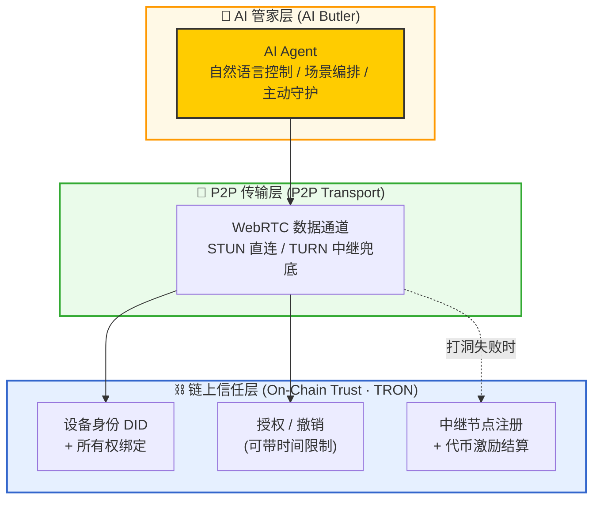
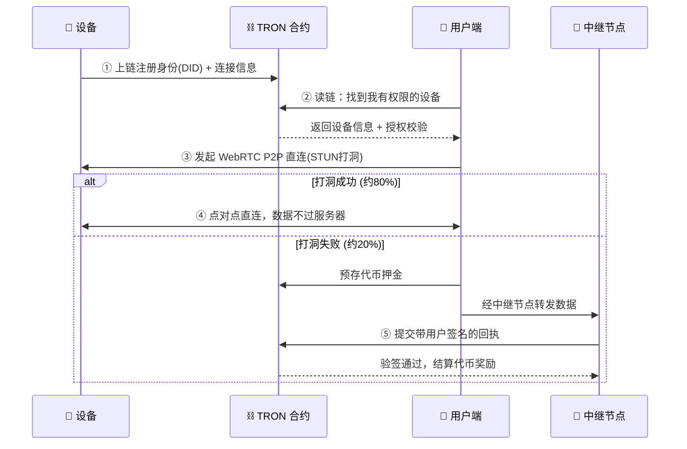

# 🔗 OmniLink：去中心化 IoT 互联与 AI 管家

> **💡 一句话定位**：让物联网设备摆脱厂商平台的层层认证，通过区块链直接与用户点对点（P2P）连接，并在此之上构建一个能管理全屋跨品牌设备的 AI 管家。
>
> **🏆 参赛赛事**：HTX Genesis 创世纪黑客松 · Genesis 赛道（AI × Web3）
>
> **🎯 核心标签**：`DePIN` · `去中心化身份(DID)` · `P2P 直连` · `AI Agent` · `TRON`

---

## 1. 📌 项目概述 (Overview)

**OmniLink** 是一个面向物联网（IoT）设备的去中心化互联协议与应用。它要解决的，是当前智能设备"接入难、互通难、被厂商锁定"这一根本痛点。

我们把设备的**身份、所有权与授权**搬到区块链上，让任何一个支持协议的客户端，都能凭借链上授权**直接连接**设备——不再经过某个厂商的中心化云平台。当这条统一的、跨厂商的设备通信通道建立起来后，AI 便获得了一个前所未有的"统一身体"：它可以管理用户名下的**全部**智能设备，无论它们出自哪个品牌，从而成为一个真正意义上的**全屋 AI 管家**。

| 维度 | 说明 |
|------|------|
| 🎯 解决的痛点 | 设备接入繁琐、跨品牌无法互通、厂商中心化锁定、隐私与控制权旁落 |
| 🧩 技术组合 | 区块链（身份/授权/激励） + P2P（WebRTC 直连） + AI（跨设备管家） |
| 🌐 所属赛道 | Genesis 赛道（AI × Web3 融合，享受额外加分） |
| 🪙 HTX 生态资源 | 智能合约部署于 TRON，使用 $HTX / TRX 设计中继激励经济模型 |
| 👥 团队 | 3 人小队 |
| ⏱️ 周期 | 约 3 周（MVP） |

---

## 2. 😖 问题与痛点 (Problem)

### 2.1 传统 IoT 的连接链路太长

今天，一台智能设备要被用户使用，通常要经过这样一条链路：

```
设备 → 厂商认证 → 厂商 IoT 平台 → 企业云 → App → 用户
```

每一跳都需要认证、都依赖某个中心化平台。这带来三个结构性问题：

* **🔒 厂商锁定 (Vendor Lock-in)**：A 品牌的设备只能用 A 的 App，连不上 B 的生态。用户家里装了 5 个品牌的设备，就要装 5 个 App。
* **🕸️ 中心化依赖**：一旦厂商云服务停服、倒闭或封禁，设备就变成"砖头"。用户对自己买的设备并没有真正的控制权。
* **🐢 链路冗长**：数据绕一大圈经过多个云平台，延迟高、隐私暴露面大、运维成本最终转嫁给用户。

### 2.2 AI 管家被困在"生态孤岛"里

正因为接入是封闭的，今天所有的 AI 语音助手（如各类智能音箱）都有一个共同的天花板：**它们只能控制自家生态内的设备**。一个 AI 管家无法跨品牌统一调度全屋设备——这不是 AI 不够聪明，而是它**没有一个统一的设备控制通道**。

---

## 3. 💡 解决方案 (Solution)

OmniLink 把上面那条冗长的链路，压缩成一条由区块链做信任背书的**直连**通路：

```
设备 ←——（链上身份 + 授权 + 发现）——→ 用户
        数据走 P2P 直连，信任走链上
```

核心思想是把"**该去中心化的**"和"**该高效传输的**"分开：

* **信任、身份、授权、发现** → 放到链上。这些是中心化平台真正"卡脖子"的地方，去掉它就破除了厂商锁定。
* **实际数据传输** → 走 P2P 直连（WebRTC），不经过任何中心化业务服务器。

### 3.1 三层架构 (Three-Layer Architecture)



| 层 | 职责 | 关键技术 | 是否去中心化 |
|----|------|----------|:---:|
| ⛓️ 链上信任层 | 设备身份、所有权、授权、中继激励 | TRON / Solidity 合约 | ✅ |
| 📡 P2P 传输层 | 设备与用户之间的实际数据直连 | WebRTC（simple-peer）、STUN/TURN | ✅（数据不过业务服务器） |
| 🧠 AI 管家层 | 跨品牌设备的统一智能控制 | LLM + Function Calling | — |

### 3.2 一次完整连接的流程



---

## 4. 🧠 AI 管家层：项目的皇冠 (The Crown)

这是 OmniLink 区别于所有现有方案的核心，也是我们冲击 Genesis 赛道加分的关键。

> **核心洞察**：底层的去中心化通信能力，让 AI 第一次获得了一个"跨厂商、统一授权"的设备控制身体。它不再是某个生态的语音助手，而是真正能管理你名下全部智能设备、并代你管理链上设备授权的自主管家。**这是单一厂商的 AI 永远做不到的。**

我们把 AI 管家的能力拆成三个递进的层次：

### 4.1 第 1 层：统一的自然语言控制（必做）

* **能力**："把客厅灯调暗、门锁上、空调调到 26 度"——一句话同时操控三个**不同品牌**的设备。
* **实现**：LLM 通过 Function Calling 把自然语言解析成对各设备的标准化指令，经链上授权校验后，通过 P2P 通道下发。
* **价值**：市面上的语音助手做不到跨品牌，因为它们的设备接入是封闭的；我们在底层把接入去中心化了，所以能做到。

### 4.2 第 2 层：跨设备场景编排（争取做）

* **能力**："我回家时，自动开灯、解锁、播放音乐"——AI 把多个不同厂商的设备编排成一个联动场景。
* **价值**：传统方案需要在每个 App 里手动配置 IFTTT 才能勉强实现，OmniLink 里 AI 一句话搞定。

### 4.3 第 3 层：主动式 AI 管家 / Agent（演示高潮 + 未来愿景）

AI 不只是被动听指令，而是主动观察设备数据 + 链上授权，自主做判断与行动：

* 🛡️ "检测到陌生人在门口长时间停留，已自动录像并提醒你。"（结合团队智能门锁背景）
* ⏳ "你给访客的临时门锁权限还有 10 分钟到期，需要延长吗？"
* 🔐 AI Agent 实际在**代用户管理链上的设备授权**——直接命中赛事规则中"AI Agent 管理链上资产/权限"的范例。

> ⚠️ **避免 AI 层沦为花瓶**：我们的 AI 价值 = `AI 能力 × 独有的跨厂商统一通道`。重点不是"套了个大模型"，而是"AI 因为站在去中心化通信层之上，能做到单一生态 AI 做不到的事"。

---

## 5. 🎬 演示主线：智能门锁场景 (Demo Storyline)

我们用**门锁**作为演示主设备——它直接关系人身与财产安全，评委一眼就懂价值，且能串起全部卖点。

> **演示脚本**：
> 1. 一台虚拟门锁启动，自动在 TRON 链上注册身份（DID）。
> 2. 用户用钱包"一键认领"这台锁，所有权绑定上链。
> 3. 用户对 AI 管家说："给保洁阿姨开一个明天下午 2–4 点的门锁权限。"
> 4. AI 在链上签发一个**带时间限制**的授权；阿姨的 App（模拟另一个厂商生态）凭链上授权**直连**门锁。
> 5. 到点后授权在链上**自动失效**，全程无任何厂商服务器参与。
> 6. （加分）AI 主动提醒："检测到一次异常的授权请求，已为你拦截。"

这一个演示同时展示了：**跨品牌互通 · 链上授权 · P2P 直连 · AI 管家 · 时间限授权自动失效**。

---

## 6. 🪙 去中心化中继激励 (Relay Incentive · DePIN)

P2P 直连在约 80% 的网络环境下可经 STUN 打洞成功；剩余约 20% 的严格 NAT 环境需要 TURN 中继兜底。**全球所有 P2P 应用都需要中继兜底，这是网络的物理限制，而非缺陷。**

OmniLink 的创新在于：**不依赖某个厂商的中心化 TURN，而是把中继做成一个由代币激励的去中心化节点网络。**

```
传统模式：厂商养一堆 TURN 服务器 → 成本算进设备/订阅费 → 用户间接买单（中心化、贵）
OmniLink：谁需要中继 → 付少量代币；谁贡献带宽 → 赚代币；平台不养服务器（去中心化、市场分摊）
```

### 6.1 资金与信任流动

| 角色 | 行为 | 说明 |
|------|------|------|
| 💰 付费方 | 需要中继的用户 | 仅在打洞失败的 ~20% 情况下，用代币付费 |
| 🔀 收费方 | 贡献带宽跑节点的人 | 运行 coturn 节点，赚取 $HTX / TRX |
| ⛓️ 结算方 | TRON 链上合约 | 验证签名回执后自动放款 |

### 6.2 验证机制：乐观信任模型 (Optimistic Trust)

"如何证明中继节点真的干了活"是整个 DePIN 领域公认的世纪难题（涉及 zk 证明、TEE 可信硬件等）。MVP 阶段我们采用**乐观信任 + 双向签名回执**：

1. 用户预存押金到合约（escrow）。
2. 中继节点转发数据（基于开源 **coturn**，零自研）。
3. 会话结束，用户对"我用了这个节点、转发了 X 流量"签名，生成**回执**。
4. 节点提交回执到合约，合约用 `ecrecover` **验签后放款**。

> ✅ 合约只做它最擅长的事：**验证签名 + 转账**，新手可控（约 2–3 天）。
>
> ⚠️ **已知边界（主动声明）**：乐观模型下用户与节点存在合谋刷量的可能。这是当前 DePIN 的共同挑战，我们将其清晰列入 Roadmap（信誉系统、随机抽查、zk 证明），而非假装已解决。坦诚边界反而是路演加分项。

### 6.3 成本说明（重要）

* **黑客松演示成本 ≈ 0**：STUN 用公共免费服务；coturn 跑在一台廉价 VPS（或免费额度）；结算用 **TRON 测试网代币**（免费领取），非真实资金。
* 用户"为演示付费"的动作，全程用测试币经过我们的合约完成，既展示真实闭环，又不花真钱。

---

## 7. 🔍 竞品分析与差异化 (Competitive Analysis)

我们的方向已被市场验证（有大资本投入），但**没有任何项目把我们这个完整组合做出来**——这是选题的理想状态。

| 能力 | IoTeX / peaq<br/>(机器经济/DePIN) | Nabto / Husarnet<br/>(P2P IoT) | **OmniLink** |
|------|:---:|:---:|:---:|
| 链上设备身份 (DID) | ✅ | ❌ | ✅ |
| 链上授权 / 跨厂商互通 | 部分 | ❌ | ✅ |
| 真 · P2P 数据直连 | ❌（只上链数据） | ✅ | ✅ |
| 去中心化中继激励 | ❌ | ❌ | ✅ |
| AI 跨设备管家 | ❌ | ❌ | ✅ |

> **差异化定位**：IoTeX 验证了"设备链上身份"的价值，Nabto 验证了"P2P 直连"的需求。OmniLink 第一次把**链上身份授权 + P2P 直连 + 去中心化中继 + AI 管家**缝合成一个面向普通用户的**消费级完整体验**。机器经济类项目偏底层基础设施，P2P 类项目缺去中心化信任——OmniLink 站在中间，做端到端可演示的产品。

> 📌 **路演话术**：主动引用竞品（"IoTeX 验证了 X，Nabto 验证了 Y，我们首次把两者 + AI 缝在一起"），比假装"全球首创"更可信、更显专业。

---

## 8. 🛠️ 技术选型与边界 (Tech Stack & Scope)

清晰地区分"拿现成的"和"自己写的"，是新手 3 周不翻车的关键。

### 8.1 拿现成的（零开发量）

| 组件 | 选型 | 用途 |
|------|------|------|
| STUN | 公共 STUN（如谷歌） | 处理 ~80% 的 P2P 打洞，免费 |
| TURN 中继 | **coturn**（开源，docker 部署） | 自建节点，演示去中心化中继 |
| TURN 兜底 | Cloudflare Realtime TURN（免费额度） | 防现场网络翻车的安全网（不作为卖点） |
| P2P 库 | WebRTC + `simple-peer` | 建立点对点数据通道 |
| 链 | TRON 测试网（Nile/Shasta） | 部署合约，测试币免费领 |
| 合约交互 | TronWeb / TronLink 钱包 | 前端连接合约与钱包 |
| AI | LLM + Function Calling | 自然语言 → 设备指令 |

### 8.2 必须自己写（项目创新点）

1. **设备身份与授权合约**（Solidity / TRON）：注册 DID、绑定所有者、授权 / 撤销（含时间限制）。
2. **中继注册与激励结算合约**：节点注册、押金托管、签名回执验证、代币结算。
3. **AI 控制层**：自然语言解析 → 指令路由 → 跨设备执行。
4. **客户端 + 虚拟设备**：把上述串成可演示的闭环。

### 8.3 明确不做（避免天坑）

* ❌ 真实 IoT 硬件固件对接（用软件模拟"虚拟设备"，最多用一块 ESP32 做点缀）。
* ❌ 自研 TURN / 数据转发（直接用 coturn）。
* ❌ 中继防作弊的密码学验证（zk/TEE，列入 Roadmap）。
* ❌ 复杂多轮对话 / 长期记忆系统（非评分重点）。

---

## 9. 📅 三周开发计划 (3-Week Plan)

| 周次 | 目标 | 关键交付物 |
|------|------|-----------|
| **第 1 周**<br/>打通地基 | 验证最高风险环节 | ① 两个 Node 进程用 WebRTC 直连发消息（与链解耦先跑通）<br/>② TRON 测试网部署设备注册/授权合约骨架<br/>③ 虚拟设备能上链注册 |
| **第 2 周**<br/>串联闭环 | 链 + P2P + 授权打通 | ① 客户端读链发现设备 + 校验授权<br/>② signaling 信息走链上，P2P 接通<br/>③ 中继激励合约（押金 + 签名结算）+ coturn 节点注册上链 |
| **第 3 周**<br/>AI 与打磨 | AI 管家 + 演示 + 提交物 | ① AI 自然语言跨设备控制<br/>② 门锁演示主线 + 一个主动场景<br/>③ 录 Demo 视频、整理开源仓库、完善文档 |

> ⏰ **风险前置原则**：第 1 周务必先单独验证 WebRTC signaling（新手最易卡壳处）。先确认 P2P 通道能通，再把它接到链上。

---

## 10. 👥 团队分工 (Team · 3人)

| 角色 | 负责人 | 职责 |
|------|--------|------|
| ⛓️ 合约 + Web3 | 你（有合约经验） | TRON 合约、钱包对接、签名验签结算 |
| 🔧 后端 + 设备 | 队员 A | 虚拟设备、coturn 部署、signaling、P2P 通道 |
| 🧠 AI + 前端 | 队员 B | AI 控制层、用户端 App、演示界面 |

---

## 11. ⚖️ 风险与对策 (Risks)

| 风险 | 等级 | 对策 |
|------|:---:|------|
| WebRTC signaling 调试耗时 | 🔴 高 | 第 1 周优先单独跑通，与链解耦 |
| 现场网络导致 P2P 连不上 | 🟡 中 | coturn + Cloudflare 双兜底；演示可同网络 |
| 中继防作弊被质疑 | 🟡 中 | 主动声明乐观模型边界 + 清晰 Roadmap |
| 范围膨胀做不完 | 🔴 高 | 死守"明确不做"清单，AI 只做第 1 层 + 一个主动场景 |
| 安全性（钱包/授权） | 🟡 中 | 测试网演示；授权合约做基础权限校验 |

> 🔐 **安全提示**：MVP 在测试网演示，不涉及真实资产。若未来上主网，设备授权、私钥管理、中继合谋是必须加固的安全重点。

---

## 12. ✅ 提交物清单 (Deliverables)

赛事要求：**开源代码仓库 + Demo 视频 + 项目文档**，且代码须为活动期间原创、最终开源，并使用至少一项 HTX 生态资源。

- [ ] 📦 开源代码仓库（GitHub，含 README 与部署说明）
- [ ] 🎥 Demo 视频（门锁演示主线，3–5 分钟）
- [ ] 📄 项目文档（本方案即可作为基础，用 `docman` 生成 HTML）
- [ ] ⛓️ HTX 生态资源使用证明（TRON 合约地址 + $HTX/TRX 激励模型）
- [ ] 🪙 测试网合约部署记录

---

> **📍 下一步**：本方案确定后，可用 `docman` 生成精美 HTML 预览，并按需同步至飞书作为团队协作蓝本。

> _本文档为 HTX Genesis 黑客松立项材料，内容将随开发推进持续迭代。_
